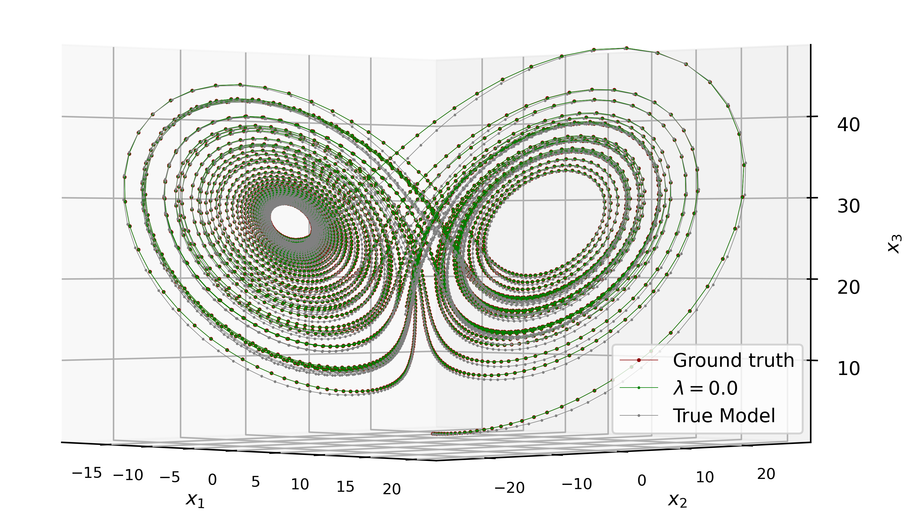
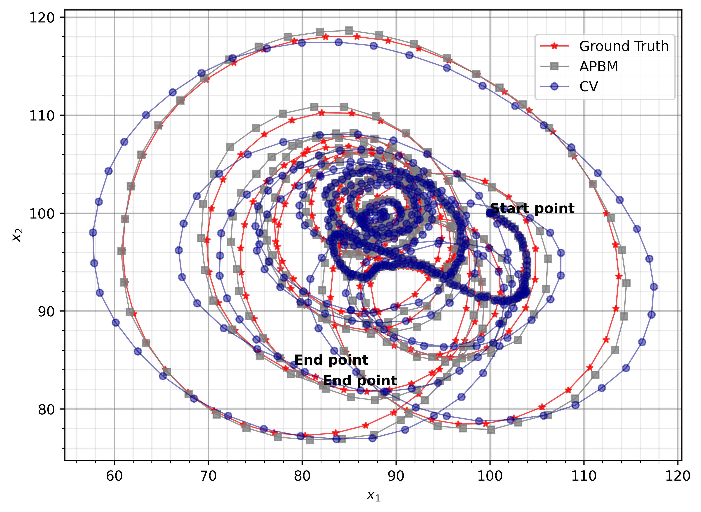

# APBM CKF

The Augmented Physics-Based Model (APBM) is implemented with the Cubature Kalman Filter (CKF) in this project.

- The `tmlp` file contains the class definition for the Multilayer Perceptron (MLP) used in the learning process.

## Tracking Results

### Lorenz Attractor Model


### Constant-Turning-Rate Model


 - For more details, refer to the paper:  
   ```
   Imbiriba, T., Demirkaya, A., Duník, J., Straka, O., Erdoğmuş, D. and Closas, P., 
   2022, July. Hybrid neural network augmented physics-based models for nonlinear filtering. In 2022 25th International Conference on Information Fusion (FUSION) (pp. 1-6). IEEE.
   ```
   [IEEE FUSION 2022: https://ieeexplore.ieee.org/document/9841291](https://ieeexplore.ieee.org/document/9841291)
