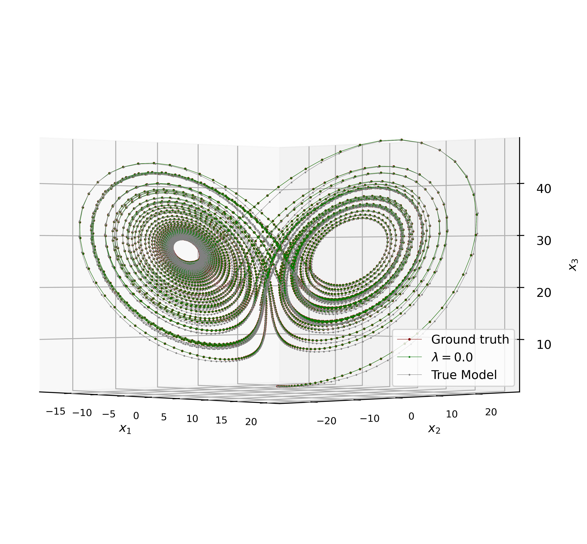

# APBM CKF

The Augmented Physics-Based Model (APBM) is implemented with the Cubature Kalman Filter (CKF) in this project.

- The `tmlp` file contains the class definition for the Multilayer Perceptron (MLP) used in the learning process.

## Tracking Results

### Lorenz Attractor Model

### Constant-Turning-Rate Model

