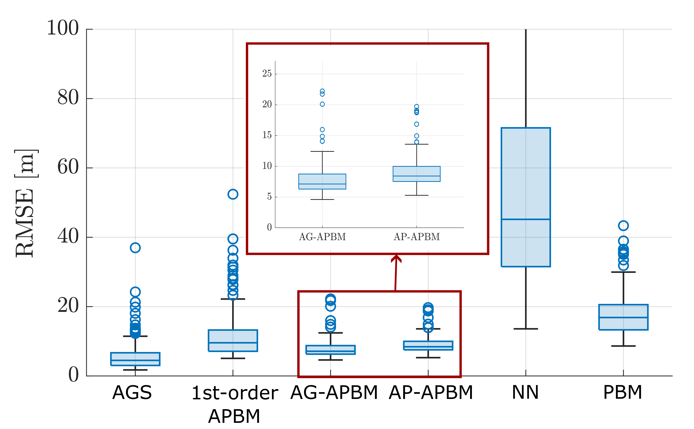

# APBM for High-Order Markov Model

This repository extends the standard Augmented Physics-Based Model (APBM) to a higher-order version with state augmentation. Two approaches are proposed:

### AG-APBM
- Extends the input size of the neural network (NN) based on the Markov order.
- Modifies the state dimension to include past few steps.

### AP-APBM
- Extends the NN input size according to the Markov order while keeping the state dimension fixed.
- Uses point estimates of past steps as NN inputs, reducing state dimension and computational cost during filtering.

## High-Order Markov Models Demonstrated

- **`apbm_ar_model.m`**: An Auto-Regressive (AR(3)) model.
- **`ctr_tracking_example_delay_feedback_augment.m`**: A state estimation problem with delayed-feedback control.

The figure below shows the RMSE of the proposed approaches for a delay-feedback control problem.
